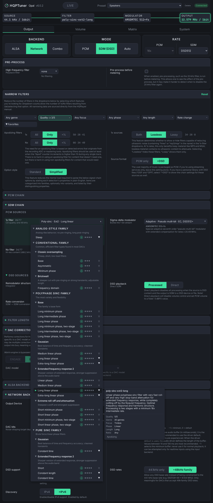
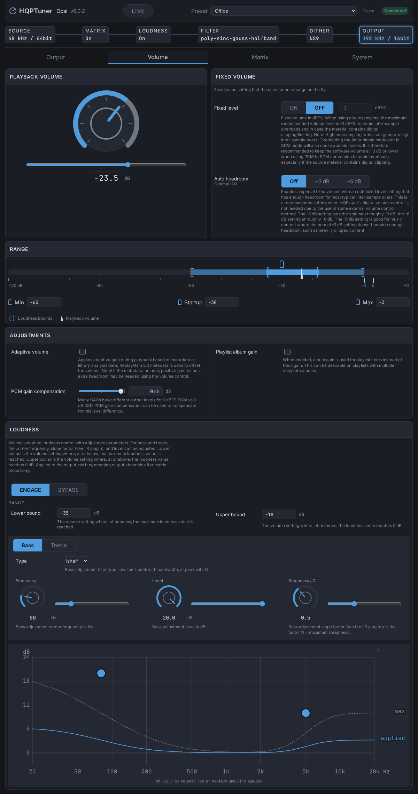
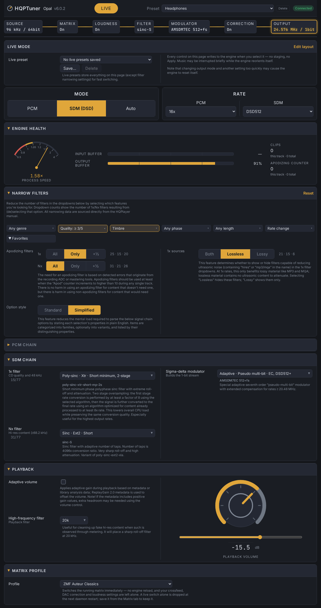

# HQPTuner: an improved configuration interface for HQPlayer Embedded

A polished and enhanced configuration interface for HQPlayer Embedded.



*The Output tab, upsampling a CD-quality file to DSD512 using the poly-sinc-ext2-long filter. The filter list is shown expanded in Simplified mode, converting the list of confusing filter shorthand into plain English. The list has also been narrowed to only show apodizing filters rated 3/5 or greater quality.*

## Inspiration

HQPlayer is, in my humble opinion, the best deal in all of high-end digital audio, with two caveats:
1. You may go broke trying to afford CPUs and GPUs to feed it the power it craves.
2. The UI is about as bad as it can be without crossing into outright malicious.

The second point is the inspiration for HQPTuner. It's not just that the default UI is poorly organized with zero aesthetic appeal, but that I saw so much untapped and wasted potential that I knew would never be acted on otherwise.

Let's take filter narrowing as an example. This is one of HQPTuner's flagship features and the one thing most badly missing from the stock UI.

The web interface presents you with four dropdowns: 1x and Nx filters for PCM and SDM, each populated by over 75 filters with baffling names like `sinc-MGa`, `IIR2`, and `poly-sinc-xtr-short-mp-2s`. To select one, you open the manual, do your best to parse the descriptions (if you even know what "minimum phase" means), find one that seems appropriate, and pick it out of the dropdown. If you're listening to Redbook content (16bit/44.1kHz), you might want an apodizing filter to correct for mastering errors. Which of the filters are apodizing? The dropdown won't tell you. There's a wealth of information in the manual, including which filters are apodizing, but if you want to cross-reference anything you're doing it in your head. The closest the stock UI gets to helping you here is that clicking "Help" takes you to another page with everything listed out rote-style for you to Ctrl+F through, same as the manual.

HQPTuner instead integrates all of the manual's filter knowledge directly into the interface, so the lists can be narrowed by quality, genre, focus, phase, length, and/or rate limits. A simple switch restricts the 1x lists to apodizing filters only and is selected by default. Your dropdown is only a handful of relevant filters in a few clicks.

HQPlayer is a complex program that takes time to learn and knowledge to optimize. A bad UI doesn't just frustrate experienced users, it holds newbies back and drives away potential new users. HQPTuner's mission is to demystify and enhance the HQPlayer experience as much as possible. It's a UI that both newbies and experts should be able to use with ease.

## Features and Improvements

HQPTuner offers the following features and improvements over the stock web configuration UI.

**1. Option names in plain English.** HQPTuner offers "Simplified" option types, converting the list of baffling filter shorthand like `poly-sinc-hb-xs-2s` into the "Extra-short two-stage option within the Half-band variants of the Polyphase Sinc filter family". Filters are sorted by family (Analog-style, Conventional, Polyphase Sinc, Interpolation, Pure Sinc, and Misc), optionally categorized by variant class (e.g., "Extreme roll-off and attenuation" or "Extended frequency response"), then by their distinguishing features within that class, e.g., phase and length. This makes it vastly simpler to parse the filter list into reasonable choices. Yes, those choices are still filter jargon, but at least it's legible filter jargon!

**2. Filter narrowing.** The manual's knowledge folded into the filter lists, so 77 opaque names narrow to the few that fit in a few clicks. Save the filters you keep coming back to with the Favorites toggle.

**3. Headphone Auto EQ.** A built-in AutoEq library of 8850+ headphone models: search your headphones, A/B the correction curve against your current response, and load it into a stereo pipeline pair in one click. AutoEq/REW ParametricEQ text files import directly too, and every EQ band becomes a draggable dot on the live response plot. Tune by ear, REW-style.

**4. Crossfeed, two ways.** HQPlayer ships Bauer crossfeed: a three-preset model with a crossover frequency and a level in dB, which are coefficients of its own filter rather than anything you can picture. It's good, but it's not my jam. So I built in an alternative: structural crossfeed feature modeling an actual head and an actual pair of speakers, from Brown & Duda's structural HRTF model. Three controls, all quantities you can picture: **speaker angle**, **head circumference**, and **center character** (ok, the last one is hard to picture, but the plots make it easy to understand). It compiles to sixteen matrix pipelines carrying an explicit interaural delay and a head-shadow filter; the shadow filter factors exactly into a flat row plus a first-order lowpass, so nothing is numerically fitted and nothing is sample-rate-bound. Integrates with and doesn't disturb your EQ curve.

The above three features are my flagships, but the following benefits are offered as well:

* **Surface the manual's knowledge**: Every feature has its manual's description printed right underneath it. This can be converted to hover tips for those who prefer a cleaner interface.
* **More sensible organization**: Settings are organized into four tabs: Output, Volume, Matrix, and System. Stop wondering where to find a certain feature.
* **Easier rate selection**: No more memorizing raw Hz values: select, e.g., PCM 4x or DSD512 from the output rate menu.
* **Idiot proofing**: Only see options that are appropriate for the settings you're running. Don't waste time trying to figure out the best Integrator if you're only outputting PCM. Running DSD512? Modulators that only work at DSD1024 are grayed out.
* **Full matrix pipeline editing**: Visual signal-flow editing of matrix pipelines, with a stage editor for every plugin type, headphone EQ import, and live response plots.
* **Live response plots**: Crossfeed, loudness, and matrix pipelines all render their frequency response as you adjust them — and EQ bands are draggable dots right on the plot, REW-style.
* **Live volume control**: For those who rely on HQPlayer for volume adjustment.
* **LIVE mode**: A switch at the top drops the tabs for a single page of everything the running engine can change in place — mode, rate, both filter chains, dither, volume, matrix profile. No Apply: each control writes when you change it. Save the lot as a **live preset** and load it back in one click.
* **Exposes more options**: Critical hardware acceleration options like multicore DSP, CUDA mode, and E-core modes are all exposed and explained.
* **Consistent behavior**: No unexpected profile switches or surprise default profile loads; HQPTuner always comes back with the settings you sent.
* **Log tail in the browser**: The daemon's log, right in the System tab.
* **Customizable accent color**: Choose from one of four presets, or roll your own with a hex code.



*The Volume tab shown with volume-adaptive loudness enabled. A response plot below tracks the boost live with the volume knob above, while the Range slider visualizes the limits, loudness bounds, and current level.*



*LIVE mode concatenates every setting the engine can change live on one rearrangeable page. Settings apply immediately upon selection. Live presets allow the user to switch all settings on the page in a single click.*

## Drawbacks of HQPTuner

While it should cover the vast majority of use cases, this is **not** a truly full-featured configuration interface.

Unavailable and unplanned features:
* Media playback and library management (use Roon)
* The convolution engine (use Matrix DSP)

Furthermore, to maintain "friendly" output rate options, the "Auto-rate family" option is always forced and setting the max rate to 32kHz multiples is impossible. If you're one of those 32k weirdos, sorry, but HQPTuner may not be for you.

**HQPTuner works with HQPlayer Embedded only.** HQPlayer Desktop has no web interface — the port-8088 configuration lane HQPTuner depends on doesn't exist there. Integration is possible with Jussi's support, so feel free to email him and let him know you'd like to see HQPTuner available for Desktop control as well.

## How it works

HQPTuner is a single small Python backend plus a no-build-step web frontend. It talks to a running `hqplayerd` over two lanes:

* **Control API (TCP 4321)** — live, restart-free settings (filters, dither/modulator, mode, rate, volume, matrix profile switching) plus status and enumerations. The running engine is the sole authority for filter/modulator names and IDs; HQPTuner never trusts shipped lists.
* **HTTP configuration interface (TCP 8088, Digest auth)** — persistent settings. Every change — including the ones the daemon's config form never exposed (CUDA offload, multicore DSP, E-core allocation, blocks/cycle) — goes through a backup → surgical `hqplayerd.xml` edit → `POST /restore` cycle; the daemon self-restarts (~5.6 s), and HQPTuner rides that out and verifies by readback.

Edits are staged in a pending-changes bar showing the live/restart split before you apply. Presets are full-config XML snapshots stored and managed by HQPTuner itself (the daemon's native profile subsystem proved unreliable), mirrored into the daemon's own config directory so the stock UI stays populated.

Descriptions, tooltips, and constraint data (e.g. each modulator's minimum rate) are extracted once from the HQPlayer manual into JSON and joined against the live engine's enumerations by name at runtime. The headphone EQ library is a pinned, vendored snapshot of [AutoEq](https://github.com/jaakkopasanen/AutoEq) (MIT).

## Requirements

* A running HQPlayer **Embedded** daemon (developed and verified against v6.0.4)
* The hqplayerd management credential (set via `hqplayerd -u/-s` or the `/auth` page) — required for persistent-config writes and presets; read-only use and live settings work without it
* Either Docker with Compose v2 OR Python v3.12+ (developed on v3.14)

## Install & run

### Docker (recommended)

If you're new to Docker, the gist is that it creates small, portable virtual machines called containers. Containers are distinct from traditional VMs in that they share the host computer's resources, but can only access file paths that you explicitly give them.

First, install Docker and the Compose plugin:

```sh
# Ubuntu
sudo apt install docker.io docker-compose-v2

# Debian 13+
sudo apt install docker.io docker-compose

# Fedora
sudo dnf install moby-engine docker-cli docker-compose
```

These are the Docker versions packaged with your OS; the Community Edition needs a separate repository, but gets faster updates and is generally recommended.

Then start the Docker daemon:

```sh
sudo systemctl enable --now docker
```

Create a new folder for HQPTuner, e.g., `~/hqptuner`. You'll also need to make the folder `~/hqptuner/state/` yourself, which holds backups and presets. If Docker creates it, it will end up owned by root.

```sh
mkdir -p ~/hqptuner/state && cd ~/hqptuner
```

Next, copy [`compose.yaml`](compose.yaml) into the `hqptuner` folder:

```sh
curl -fLO https://raw.githubusercontent.com/ohshitgorillas/hqptuner/main/compose.yaml
```

Put your hqplayerd credentials into a `.env` file: run `nano .env` and enter your username and password.

```
HQPTUNER_HQP_USERNAME="username"
HQPTUNER_HQP_PASSWORD="password"
```

The default `compose.yaml` configuration assumes that HQPTuner is running on the same host as HQPlayer/hqplayerd; if HQPTuner is on a separate machine, you'll need to edit the compose file to:

* set `HQPTUNER_HQP_HOST` to the IP address of the hqplayerd host.
* delete the `extra_hosts` lines.

Once the compose file is correct, bring the container up with:

```sh
# must be run from within the same folder as compose.yaml
sudo docker compose up -d
```

Then open `http://yourserverIP:8090` in your favorite browser, and enjoy HQPTuner!

Images are published to `ohshitgorillas/hqptuner` on Docker Hub (amd64 + arm64) in two channels:

| Tag | Branch | Who it's for |
|---|---|---|
| `:latest` | `main` | Everyone. The stable channel. |
| `:beta` | `beta` | Testers trying a fix before it ships. Expect rough edges. |
| `:vX.Y.Z` | version tags | Pinned to one release. |

The same images are mirrored to `ghcr.io/ohshitgorillas/hqptuner` with identical tags, so an existing `ghcr.io/...` compose file keeps working and keeps updating. Either registry is fine; they're built from the same commit in the same job.

To try a beta build, point the image at `ohshitgorillas/hqptuner:beta` in your `compose.yaml` and `docker compose pull && docker compose up -d`. Switch back by setting it to `:latest` and pulling again.

**Docker Pro Tip:** Use [Watchtower](https://watchtower.nickfedor.com/) for automated updates of HQPTuner and your other containers.

### From a clone (no Docker)

```sh
python3 -m venv .venv
.venv/bin/pip install -e .

.venv/bin/python -m hqptuner
# non-stock daemon credential:
# HQPTUNER_HQP_USERNAME=<user> HQPTUNER_HQP_PASSWORD=<pass> .venv/bin/python -m hqptuner
```

## Configuration reference

All knobs are environment variables (see `hqptuner/config.py`):

| Variable | Default | Purpose |
|---|---|---|
| `HQPTUNER_HQP_HOST` | `127.0.0.1` | hqplayerd host |
| `HQPTUNER_HQP_CONTROL_PORT` | `4321` | Control API port |
| `HQPTUNER_HQP_HTTP_PORT` | `8088` | hqplayerd web config port |
| `HQPTUNER_HQP_METERING_PORT` | `4322` | hqplayerd's metering side channel, read by the junk-filter advisor. Control port + 1 on a stock daemon |
| `HQPTUNER_METERING_ENABLED` | `1` | Whether the junk-filter advisor runs. Set to `0` and HQPTuner never connects to the metering port, never offers junk-filter advice, and grays the high-frequency filter's auto-pilot, which has nothing left to act on; nothing else changes |
| `HQPTUNER_HQP_USERNAME` | `hqplayer` | Management username (Digest auth); default is hqplayerd's stock credential |
| `HQPTUNER_HQP_PASSWORD` | `password` | Management password; default is hqplayerd's stock credential |
| `HQPTUNER_HQP_HOME` | `/var/lib/hqplayer/home` | hqplayerd's data/home directory on the daemon host (uploaded convolution impulses land here) |
| `HQPTUNER_LISTEN_HOST` | `127.0.0.1` | HQPTuner bind address |
| `HQPTUNER_LISTEN_PORT` | `8090` | HQPTuner port |
| `HQPTUNER_POLL_INTERVAL` | `2.0` | Status poll cadence (s) |
| `HQPTUNER_ALARM_THRESHOLD` | `15.0` | Seconds unreachable before alarm |
| `HQPTUNER_REQUEST_TIMEOUT` | `5.0` | Per-request timeout (s) |
| `HQPTUNER_DATA_DIR` | packaged `hqptuner/data/` | Static metadata JSON |
| `HQPTUNER_BACKUP_DIR` | `backups/` | Pre-apply config backups |
| `HQPTUNER_PRESET_DIR` | `presets/` | HQPTuner-owned preset store |
| `HQPTUNER_LIVE_PRESET_FILE` | `state/live-presets.json` | The LIVE view's saved setting combos, one JSON file |
| `HQPTUNER_FAVORITES_FILE` | `state/favorites.json` | Starred filter names, one JSON file shared by every browser |
| `HQPTUNER_AUTOPILOT_FILE` | `state/autopilot.json` | The high-frequency filter's auto-pilot: whether it is on, the filter it falls back to, and which config presets carry it |
| `HQPTUNER_DEBUG_LOG` | unset (off) | Path to the append-only event log. Unset means no file and no records. Set it to record every durable write — staged edits, applies, profile writes, preset writes — as JSON Lines, e.g. `/state/audit.jsonl` in the container |
| `HQPTUNER_LOG_LEVEL` | `INFO` | Level for ordinary prose logging. A level name, not a number; an unparseable value falls back to `INFO` rather than refusing to start |

## Status

**Stable.** v1.0.0 is the first release off the beta channel. Backend and frontend are feature-complete and live-validated against hqplayerd 6.0.4, and Docker images ship for amd64 and arm64 on the `:latest` tag.

Bug reports and contributions are welcome and encouraged. See `CONTRIBUTING.md` for contribution guidelines.

## License

[MIT](LICENSE). The Control API implementation is derived from Jussi Laako's official `hqp-control` utility source, itself MIT-licensed, with attribution. The vendored headphone EQ database is from [AutoEq](https://github.com/jaakkopasanen/AutoEq) (MIT).
